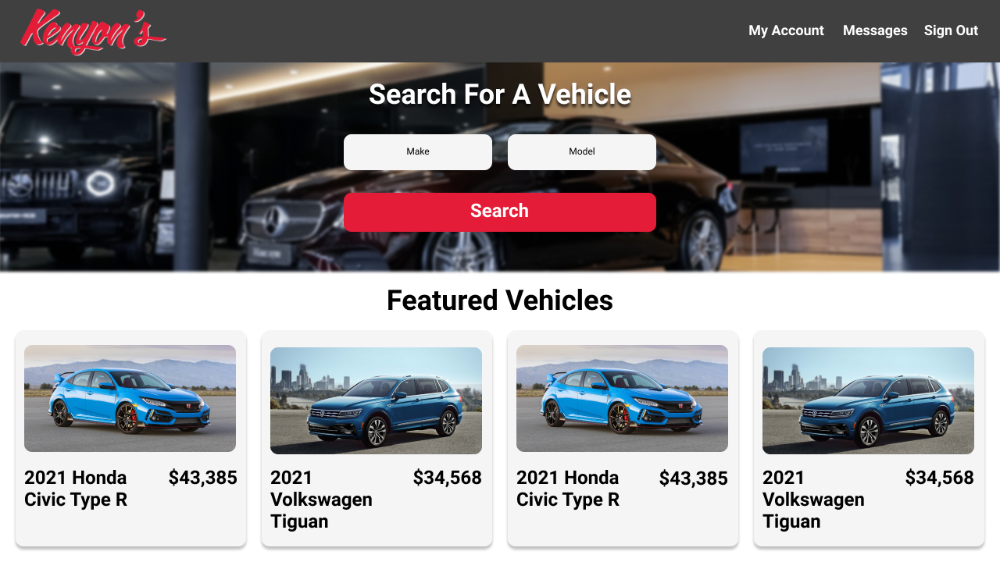
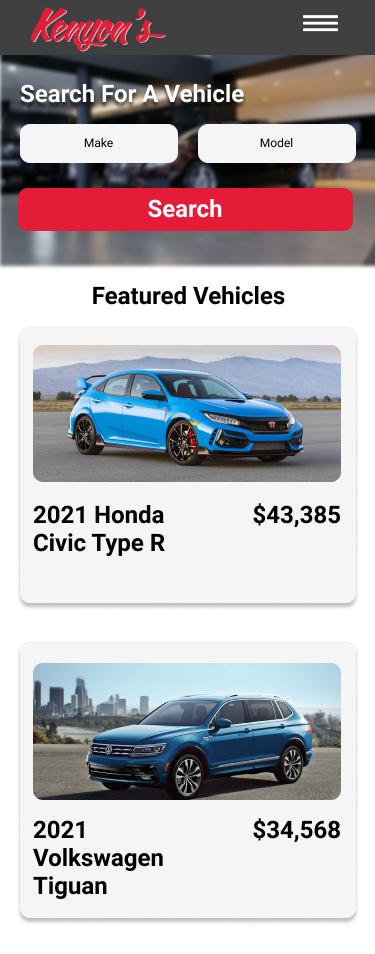
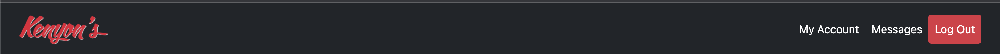
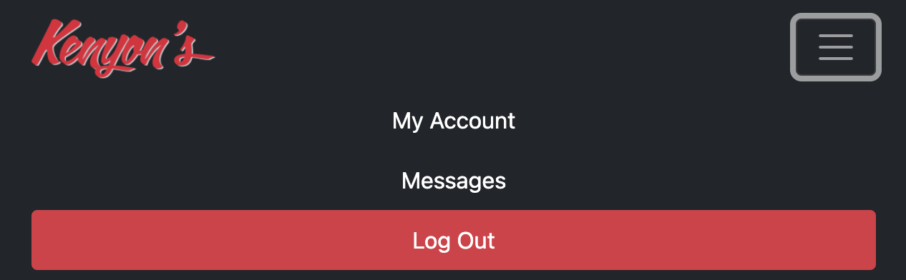
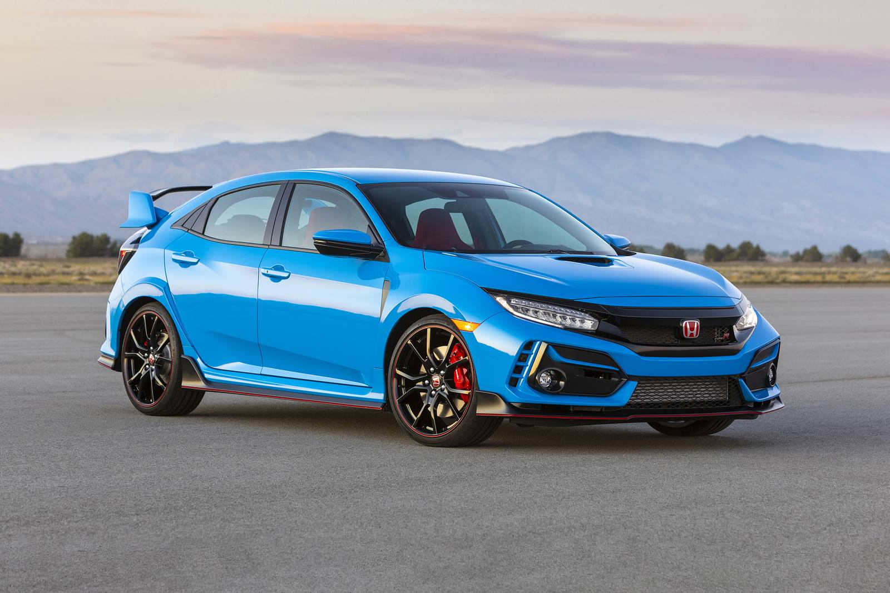
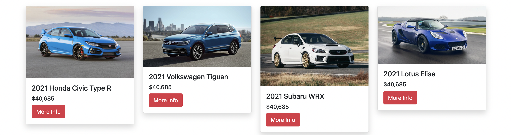
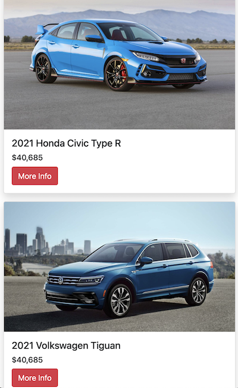

## Spike Project – Bootstrap 5


#### Background

​	When designing user interfaces, its often hard to translate beautiful concepts into HTML and CSS. Building your own CSS library from scratch can be time consuming and stressful. Because of this problem, programmers often resort to CSS frameworks such as Tailwind, Foundation, and Bootstrap. These libraries provide consistent components, grid systems, and color palattes to build responsive user interfaces. With this, there is no headache of building your own grid system for layouts, or adapting your content to fit on mobile viewports. 

​	For this project I chose Bootstrap, as it is the most popular CSS framework to build websites. It also would help with our Software Engineering project, as we needed to design a responsive web app. Early on in the project, I created some mockups of the website in Figma, but was struggling to translate them into pure HTML, CSS, and Javascript. Thankfully, I designed these mockups on a 12 column grid similar to the one used by Bootstrap, so the translations were relatively simple.


#### Practice and Experimentation

​	For this experiment, I built each of my Figma mockups using bootstrap. The full site can be explored [here](https://fkscott.github.io/spike_bootstrap/). My github repo with the full source code can be explored [here](https://github.com/fkscott/spike_bootstrap). Below is the mockup of the homepage a user sees when logging in. I needed a navbar, dropdown menus, and cards to show featured vehicles. 

<figure align="center">
  
  <figcaption>Figma mockup of the homepage at a desktop viewport</figcaption>
</figure>

<figure align="center">
  
  <figcaption>Figma mockup of the homepage at a mobile screen size</figcaption>
</figure>

​	I began by studying Bootstraps plentiful examples for a reusable component we needed: a navbar. Below is a pro Bootstrap provides classes for responsible navigation bars that are customizable to your liking. The declaration was 

``` HTML
<nav class="navbar navbar-expand-md navbar-dark bg-dark px-3">
  <!-- Divs for buttons and logos -->
</nav>
```

The most useful of these was the `navbar-expand-md` class, which means the navbar is full width until it collapses at the medium breakpoint of 768px or less.

<figure align="center">
  
  <figcaption text-align="center">Navbar at full width</figcaption>
</figure>


<figure align="center">
  
  <figcaption text-align="center">Navbaar at medium breakpoint</figcaption>
</figure>

Breakpoints in Bootstrap also work for other page components, which I would need for my cards and the search options. I placed my cards in a container div that contained a grid with one row and four columns. Each column had a similar declaration:

```HTML
<div class="col-md-3">
	<div class="card shadow mb-3">
	 

		<div class="card-body">
			<h5 class="card-title">2021 Honda Civic Type R</h5>
      <h6>$40,685</h6>
      <a href="./vehicle.html" class="btn btn-danger">More Info</a>
     </div>
		</div>
</div>
```

The `col-md-3` class means that each card will take up 3 columns on Bootstrap's 12 column grid until the medium breakpoint. At the medium breakpoint and below, the card will take up the full width of the grid.

<figure align="center">
	
	<figcaption text-align="center">Cards at desktop viewport</figcaption>
</figure>

<figure align="center">
	
	<figcaption text-align="center">Cards at mobile viewport</figcaption>
</figure>


The rest of the pages consisted of similar components. First I referenced my Figma designs and checked how many columns an element took up. Then, I added the correct column class for each component on my page and let Bootstrap take care of the media queries. This way I didn't have to write any CSS besides the background image for the search box. 


#### Questions

When exploring the Bootstrap framework, I had questions about customizing the existing framework to support a specific color scheme. From cursory research on the Bootstrap docs, it requires the use of a preprocessor like Sass to customize certain components.


#### Reflections

After studying Bootstrap, I see the value in CSS frameworks. They allow you to quickly build webpages while adhering to good design guidelines. Setup is simple, and the framework can be included in 2 lines in your HTML page, or integrated into a package manager like npm.  If you wanted to quickly build a site that is friendly and intuitive, a CSS framework like Bootstrap is much simpler than building your own CSS from scratch.
